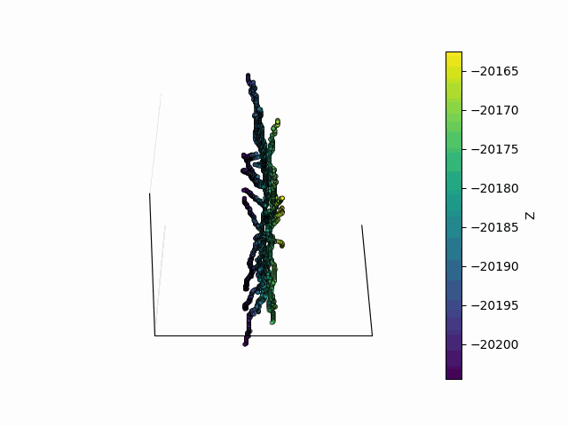
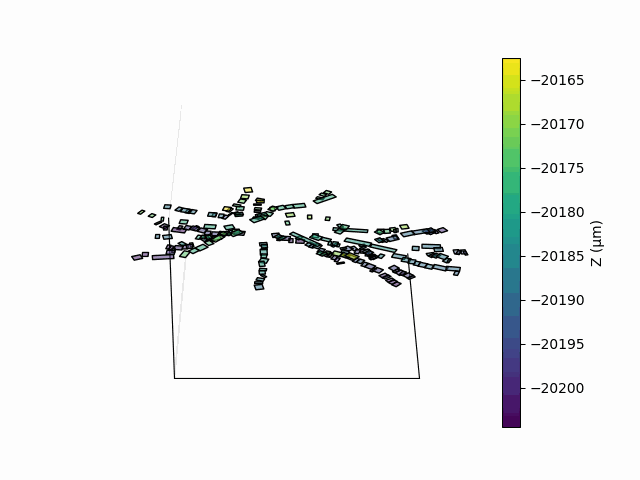
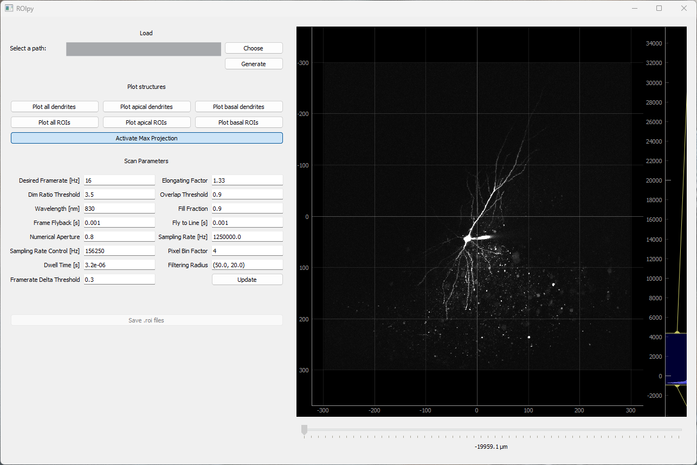

# ROIpy

## Description

**ROIpy** is a python package for ROI (Region of Interest) semi-automatic generation and placement for functional imaging of neuronal dendrites of individual neurons. It provides a tool for defining, managing and visualizing dendritic ROIs. In addition, provides a benchmark for analyzing morphological data such as dendritic structure.

Designed to interface with [Vidrio ScanImage software](https://vidriotechnologies.com/) (now [MBF](https://www.mbfbioscience.com/products/scanimage/)).

### ScanImage setup

ROIpy is designed to facilitate scanning along dendritic arborization. In Scanimage, it works for **Linear Scan - Frame scan** configuration (_Galvo-Galvo_). ROIpy is developed to overcome the inherent 2D limitation of arbitrary scanning, by generating a set of discrete planes populated with scattered rectangular ROIs spanning the depth of the neuron.

It outputs `.roi` files which can be loaded and are interpreted by ScanImage [mROI Editor Window](https://docs.scanimage.org/Premium+Features/Multiple+Region+of+Interest+(MROI).html).

### Dendrite tracing

Tested to work with `.swc` files generated with ImageJ Fiji plugin [Simple Neurite Tracer (SNT)](https://imagej.net/plugins/snt/). `.swc` files generated with different softwares are not tested and may raise errors. Common labels are **apical dendrite** or **basal dendrite** or **soma**.

## Installation

Clone the repository and install the package:

```bash
git clone https://github.com/dcupolillo/ROIpy.git
cd ROIpy
pip install -e .
```

**or optional:** you can create a conda environment first:

```bash
git clone https://github.com/dcupolillo/ROIpy.git
cd ROIpy
conda env create -f environment.yaml
conda activate roipy
pip install -e .
```

## Features

`ROIpy` is composed of 3 main structures: **Stack**, **Morphology**, **Scanfields**. Morphology and Scanfields are further composed of **bundles** which in turn are formed by individual **components**. 

#### Stack

Represents a stack of images of a given neuron, which includes all dendrites across depth.
The initial Stack is acquired using Scanimage [Stack Control](https://docs.scanimage.org/Basic+Features/Stack+Acquisition.html). Each z-layer defines the discrete planes whereon ROIs will be placed. The stack is necessary to outline the dendritic structure using SNT.

#### Morphology

Object defining the digitized structural anatomy of a dendritic arborization (``.swc``). This object is necessary to drive the placement of dendritic rectangular ROIs. 

#### Scanfields

Represents the ensembles of rotated rectangular ROIs that encapsulate the entire dendritic tree region.

## Example usage

```python
import ROIpy as rp

# Initialize a stack of images of an individual neuron
stack_filename = "path/to/your/stack"
stack = rp.Stack(stack_filename)

# Initialize the morphology with image and tracing files
swc_filename = "path/to/your/swc"
morph = rp.Morphology(swc_filename, stack_filename)

# Initialize the scanfields with image and tracing files
sf = rp.Scanfields(morph)
```

### Hierarchical organization

The ``morphology`` structure resides in:

```python
nodes_list = morph.neuron

# Indexing to access individual nodes
node = morph.neuron[0]
```

``Scanfields`` are organized in z-planes, wherein individual ``Roi`` are nested:

```python
zplanes_containing_rois = sf.neuron

# Indexing to access individual ROIs
roi = sf.meuron[0][0] # first z-plane, first roi
```

## Plotting API

You can visualize any supported structure (Stack, Morphology, Scanfields), bundle (NodeBundle, ScanfieldBundle) or component (Node, Roi) by passing it to `plot()`. The function automatically dispatches to the correct plotter and supports flexible keyword arguments (`**kwargs`) for customization. 

```python
# Plot the stack image
rp.plot(stack, cmap="viridis", norm=(100, 2000))

# Plot the morphology
rp.plot(morph.neuron, show_nodes=True, cmap="jet", linewidth=1)

# Plot the scanfields
rp.plot(sf.neuron, edgecolor="red")

# 3D plotting example
rp.plot(morph.neuron, projection='3d', show_nodes=True, cmap="jet")
```


### Animation

If you want to animate 3D visualizations, use the unified `animate()` function:

```python
morph_anim = rp.animate(
	morph.neuron,
	flip_yz=True,
	axis_label=False,
	zoom=2,
	cmap="viridis",
	show_nodes=True, 
	show_cbar=True,
	save_path="morph_anim.gif")

scanfields_anim = rp.animate(
	sf.neuron,
	sf.metadata,
	cmap="viridis",
	show_cbar=True,
	axis_label=False,
	interval=250,
	zoom=1.5,
	save_path="scanfields_anim.gif")
```





## GUI to interact with ScanImage mROI tool

```python
import ROIpy as rp

rp.run_app()
```


