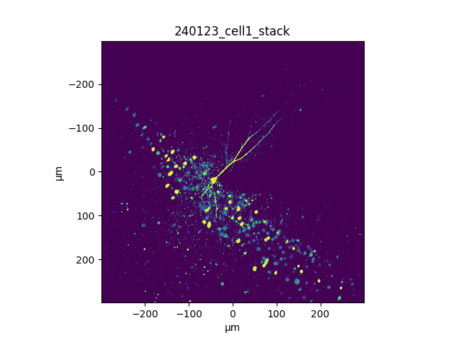
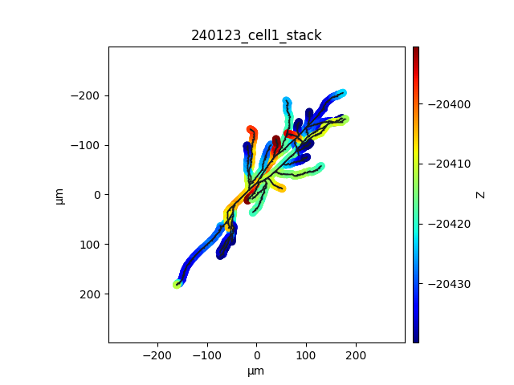
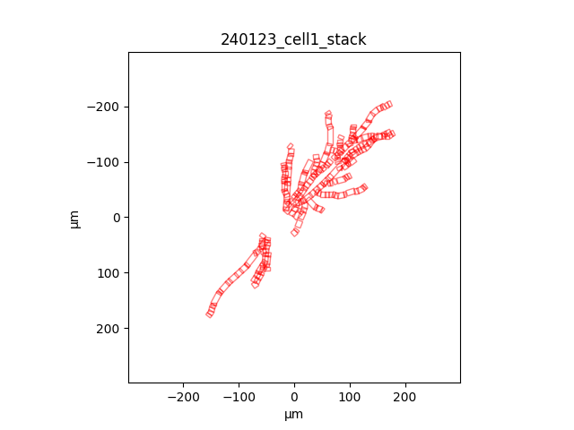

# ROIpy

## Description

**ROIpy** is a python package for ROI (Region of Interest) semi-automatic generation and placement for functional imaging of neuronal dendrites of individual neurons 🔬:brain:. It provides a tool for defining, managing and visualizing dendritic ROIs. In addition, provides a benchmark for analyzing morphological data such as dendritic structure.

Designed to interface with [Vidrio ScanImage software](https://vidriotechnologies.com/) (now [MBF](https://www.mbfbioscience.com/products/scanimage/)).

### ScanImage setup

ROIpy is designed to facilitate scanning along dendritic arborization. In Scanimage, it works for **Linear Scan - Frame scan** configuration (_Galvo-Galvo_). ROIpy is developed to overcome the inherent 2D limitation of arbitrary scanning, by generating a set of discrete planes populated with scattered rectangular ROIs spanning the depth of the neuron.

It outputs `.roi` files which can be loaded and are interpreted by ScanImage [mROI Editor Window](https://docs.scanimage.org/Premium+Features/Multiple+Region+of+Interest+(MROI).html).

### Dendrite tracing

Tested to work with `.swc` files generated with ImageJ Fiji plugin [Simple Neurite Tracer (SNT)](https://imagej.net/plugins/snt/). `.swc` files generated with different softwares are not tested and may raise errors. Common labels are **apical dendrite** or **basal dendrite** or **soma**.

## Installation

#### Option 1: Create a Conda environment (recommended)

Create the environment with required packages using the provided `environment.yaml` file:

```powershell
conda env create -f environment.yaml
conda activate roipy
```

#### Option 2: Install via Git Clone

Clone the repository and install it locally:

```git
git clone https://github.com/dcupolillo/ROIpy.git
```

#### Option 3: Manual copy

Simply copy the folder "ROIpy" within your project folder 📁. Ensure the folder is in your system path.

```python
import sys
sys.path.append("path/to/ROIpy")
```

## Features

`ROIpy` is composed of 3 main structures: **Stack**, **Morphology**, **Scanfields**. Morphology and Scanfields are further composed of **bundles** which in turn are formed by individual **components**. Each strucures handles metadata, indexing, and plotting methods for visual inspection.

#### Stack

Represents a stack of images of a given neuron, which includes all dendrites along depth.
The initial Stack is acquired using Scanimage [Stack Control](https://docs.scanimage.org/Basic+Features/Stack+Acquisition.html). Each z-layer defines the discrete planes where ROIs will be placed on. The stack is necessary to outline the dendritic structure using SNT.

#### Morphology

Object defining the digitized structural anatomy of a dendritic arborization drawn using SNT. This object is necessary to drive the placement of dendritic rectangular ROIs. A morphology object can also be used to run morphological analysis of dendritic structure.

#### Scanfields

Represents the rotated rectangular ROIs that encapsulate the entire dendritic tree region.

## Example usage

```python
import ROIpy as rp

# Initialize a stack of neuron images
stack_filename = "path/to/your/stack"
stack = rp.Stack(stack_filename)

# Initialize the morphology with image and tracing files
swc_filename = "path/to/your/swc"
morph = rp.Morphology(swc_filename, stack_filename)

# Initialize the scanfields with image and tracing files
sf = rp.Scanfields(morph)
```

## Plotting API

ROIpy now provides a unified `plot()` function at the package level. You can visualize any supported structure (Stack, Morphology, Scanfields), bundle (NodeBundle, ScanfieldBundle) or component (Node, Roi) by passing it to `rp.plot()`. The function automatically dispatches to the correct plotter and supports flexible keyword arguments for customization. `rp.plot()` accepts flexible keyword arguments (`**kwargs`) for customizing colors, linewidths, colormaps, and more. These are dispatched to the appropriate underlying plotter for each data type.

```python
# Plot the stack image
rp.plot(stack, cmap="viridis", norm=(100, 2000))

# Plot the morphology
rp.plot(morph.neuron, show_nodes=True, cmap="jet", linewidth=1)

# Plot the scanfields
rp.plot(sf.neuComp, edgecolor="red")

# 3D plotting example
rp.plot(morph.neuron, projection='3d', show_nodes=True, cmap="jet")
```







### Animation

If you want to animate 3D visualizations, use the unified `animate()` function:

```python
anim = rp.animate(
	morph.neuron,
	flip_yz=True,
	axis_label=False,
	zoom=2,
	cmap="viridis",
	show_nodes=True, 
	show_cbar=True,
	save_path="morph_anim.gif")
```


## GUI to interact with ScanImage mROI tool
